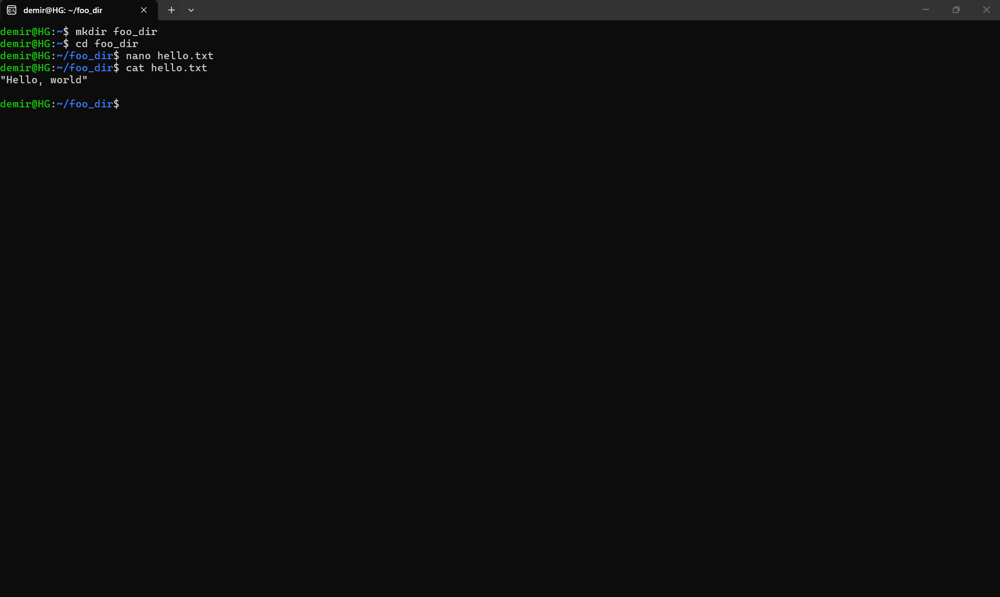

  <!-- GERÇEK HAREKETLİ DESTANDI KOZMİK BANNER (GEZEGEN VE UZAY DÖNÜYOR) -->
  

   
   

  <h1>🌌 Intro to Astro: Exoplanet Detection & Deep Learning 🌌</h1>

  **Astro-Portfolio of Kemal Sadık Demirbaş | Software Architect & Data Scientist**

  

    
    
    
    
    
    
  

  <i>Welcome to my central repository for the international astronomy and data science program.</i>

 

---

## 🌌 Program Overview
* **Role:** Student / Software Architect
* **Core Focus:** Planetary formation models, exoplanet detection methodologies, and deep learning integration in astrophysics.
* **Timeline:** July 2026 onwards.

---

## 📁 Repository Roadmap & Structure

### 🟩 Week 1: Linux Unix & Version Control Systems
* **Terminal Practice (`foo_dir/`):** Core hands-on session mastering file structures, terminal commands, and system control.
  * 🖥️ **[View Terminal Operations Screenshot](./week1/assignment1_terminal_practice.png)**
* **Git Fundamentals:** Establishing local time machines, committing configurations, and repository synchronization.
  * 🚀 **[View Git Deployment Screenshot](./week1/assignment4_git_practice.png)**
* **Literature Survey:** Annotated analysis on exoplanet radius valley papers.
  * 📄 **[Read My Annotated Research Paper (PDF)](./week1/annotated_astro_paper.pdf)**

### 🟧 Week 2: Python Programming & Exoplanet Detection
* **Data Pipelines & Analytics:** Engineered robust Python data streams using NumPy, SciPy, and Pandas.
* **Transit Photometry Modeling:** Implemented the `batman` package to execute transit light-curve simulations.
* **Radial Velocity Analytics:** Modeled stellar reflex motions and velocity semi-amplitudes.
* **MCMC Parameter Optimization:** Deployed the `emcee` (Ensemble Sampler) framework for Bayesian parameter inference.
* **Planetary Interior Inference:** Evaluated mass-radius dimensions against theoretical compositions.
  * 📂 **[View Notebook: Exoplanet Detection Methods](./week2/Intro2Astro_ExoplanetDetectionMethods.ipynb)**
  * 📂 **[View Notebook: Python & Jupyter Tutorial](./week2/Python_Tutorial_with_Answers.ipynb)**
* 📄 **Literature Survey:** Deep dive into the exoplanet detection review paper.
  * 📥 **[Read/Download the Original Review Paper (PDF)](./week2/Lee_2018_Exoplanet_Detection_Review.pdf)**
  * 📝 **[Read My Analytical Discussion & Questions (PDF)](./week2/Literature_Review_Questions_Lee_2018.pdf)**

### 🟦 Week 3: Exoplanet Archive Pipeline & Planet Radius Valley
* **NASA Exoplanet Archive Data Mining:** Processed and filtered confirmed/candidate exoplanet populations ($N = 2,601$ Kepler, $N = 588$ TESS).
* **Radius Valley Analysis:** Bimodal distribution modeling revealing the radius gap at $1.8\text{--}2.0\,R_\oplus$ separating super-Earths from sub-Neptunes.
* **Matplotlib Scientific Plotting Suite:** Custom 2D/3D visualizations, multi-axes configurations, and astronomical exposure simulations.
  * 📂 **[View Notebook: Exoplanet Archive Pipeline](./week3/Intro2Astro_Week3_ExoplanetArchive_mentor.ipynb)**
  * 📂 **[View Notebook: Plot Fundamentals](./week3/01_plot_fundamentals_with_answers.ipynb)**
  * 📂 **[View Notebook: Axes & Scientific Plots](./week3/02_axes_and_scientific_plots_with_answers.ipynb)**
  * 📂 **[View Notebook: 2D & 3D Plots](./week3/03_2d_and_3d_plots_with_answers.ipynb)**
  * 📊 **[View Dataset: NASA Exoplanet Composite Parameters (CSV)](./week3/PSCompPars_2026.07.21_03.29.27.csv)**
* 📄 **Literature Survey (Zeng et al., 2019):** Growth model interpretation of planet size distribution.
  * 📥 **[Read/Download Zeng et al. (2019) Paper (PDF)](./week3/zeng-et-al-2019-growth-model-interpretation-of-planet-size-distribution.pdf)**
  * 📝 **[Read My Literature Review & Analytical Questions (Markdown)](./week3/zeng_et_al_2019_literature_review.md)**
  * 📝 **[Read My Literature Review & Analytical Questions (PDF)](./week3/zeng_et_al_2019_literature_review1.pdf)**

---

### 📷 Week 1 Execution Proofs
Here is a direct preview of the accomplished terminal environment tasks:

---

### 📷 Week 2 Diagnostic Preview
The definitive multi-dimensional joint and marginal posterior probability distributions from MCMC sampling:

  

---

### 📷 Week 3 Radius Valley Distribution Preview
Comparative small-planet radius distribution ($1\text{--}6\,R_\oplus$) comparing Kepler ($N=2,601$) vs. TESS ($N=588$) detections overlaying the bimodal radius valley:

  

---

> **Discord Status Note:** Due to regional platform access limitations, all weekly research questions, code deliverables, and logbook entries are maintained and submitted directly via this repository and the shared Google Drive directory.

---

***Maintained with 🖥️ by Kemal Sadık Demirbaş.***
